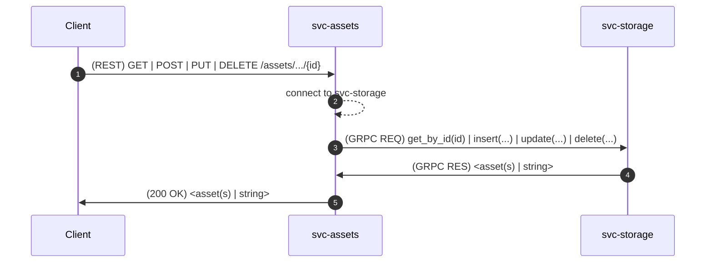
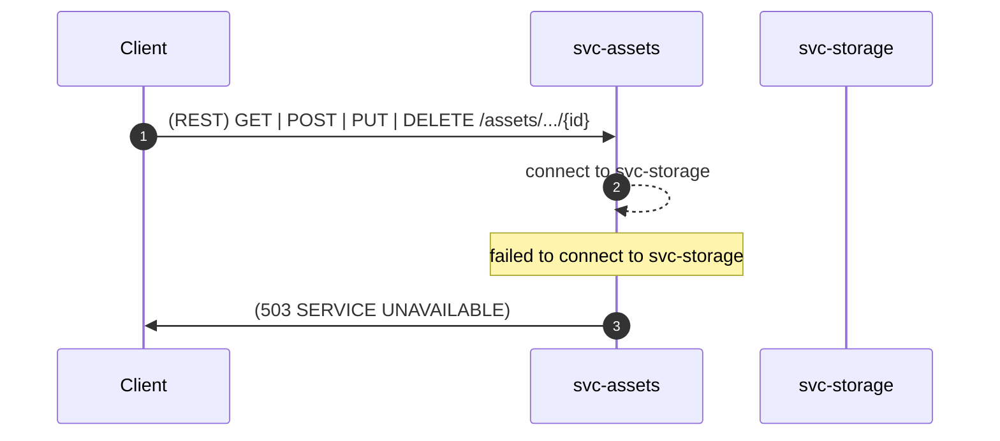
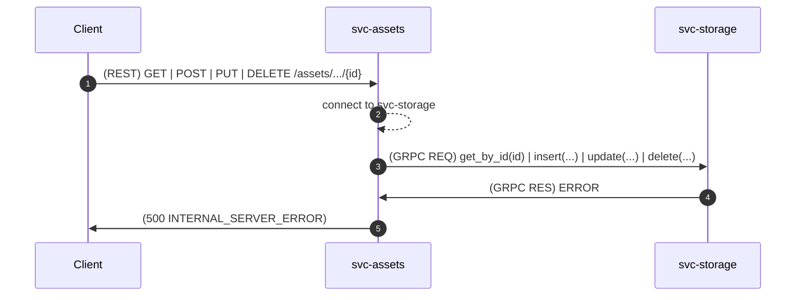

# Software Design Document (SDD) - `svc-assets` 

## :telescope: Overview

This document details the software implementation of `svc-assets`.

This service is responsible for managing operators' assets.

### Metadata

| Attribute     | Description                                                       |
| ------------- |-------------------------------------------------------------------|
| Maintainer(s) | [Aetheric Realm Team](https://github.com/orgs/aetheric-oss/teams/dev-realm) |
| Stuckee       | [@amsmith-pro](https://github.com/amsmith-pro)                        |
| Status        | Draft                                                             |

## :books: Related Documents

Document | Description
--- | ---
[High-Level Concept of Operations (CONOPS)](https://github.com/aetheric-oss/se-services/blob/develop/docs/conops.md) | Overview of Aetheric microservices.
[High-Level Interface Control Document (ICD)](https://github.com/aetheric-oss/se-services/blob/develop/docs/icd.md) | Interfaces and frameworks common to all Aetheric microservices.
[Requirements - `svc-assets`](https://nocodb.aetheric.nl/dashboard/#/nc/view/08f51c89-565d-40b4-984e-9ed75eea1f26) | Requirements and user stories for this microservice.
[Concept of Operations - `svc-assets`](./conops.md) | Defines the motivation and duties of this microservice.
[Interface Control Document (ICD) - `svc-assets`](./icd.md) | Defines the inputs and outputs of this microservice.

## :dna: Module Attributes

Attribute | Applies | Explanation
--- | --- | ---
Safety Critical | No | The module does not have direct impact on human safety.
Realtime | Yes | The module tracks the real-time availability of assets.

## :gear: Logic

### Initialization

At initialization this service creates two servers on separate threads:
a GRPC server and a REST server. 

:exclamation: The GRPC server exists only for health-checking purposes
(i.e. Is the server up and running?).

The REST server expects the following environment variables to be set:
- `DOCKER_PORT_REST` (default: `8000`)

The GRPC server expects the following environment variables to be set:
- `DOCKER_PORT_GRPC` (default: `50051`)

### Control Loop

As a REST and GRPC server, this service awaits requests and executes handlers.

Some handlers **require** the following environment variables to be set:
- `STORAGE_HOST_GRPC`
- `STORAGE_PORT_GRPC`

This information allows `svc-assets` to connect to other microservices to obtain
information requested by the client.

:exclamation: These environment variables will *not* default to anything if not
found. In this case, requests involving the handler will result in a `503
SERVICE UNAVAILABLE`.

For detailed sequence diagrams regarding request handlers, see [REST
Handlers](#mailbox-rest-handlers).

### Cleanup

None

## :mailbox: REST Handlers
You can think of `svc-assets` as a client-facing wrapper for
`svc-storage`. Clients make REST requests to `svc-assets`, the
microservice will then parse payloads and make RPC calls to
`svc-storage`. The `svc-assets` microservice will then process and
return responses returned from `svc-storage`.

This is a process followed by most of the endpoints of `svc-assets` that
perform CRUD operations. The only possible exception is the delegation
process, which has not been implemented yet.

The service returns either a list of assets or a single asset, or a
string indicating the uuid of the asset created/updated/deleted.

**Nominal**:

**Off-Nominal**: Failed to connect to `svc-storage`

**Off-Nominal**:  Request to `svc-storage` failed

